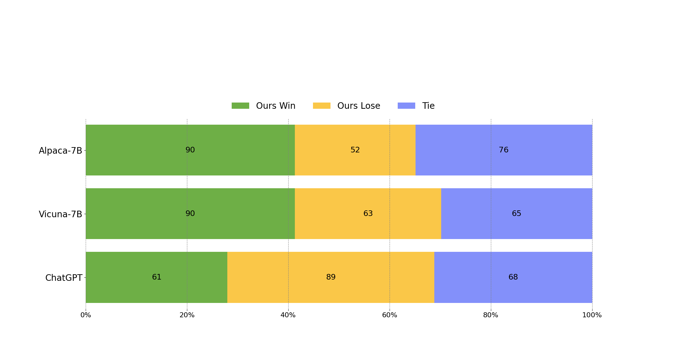
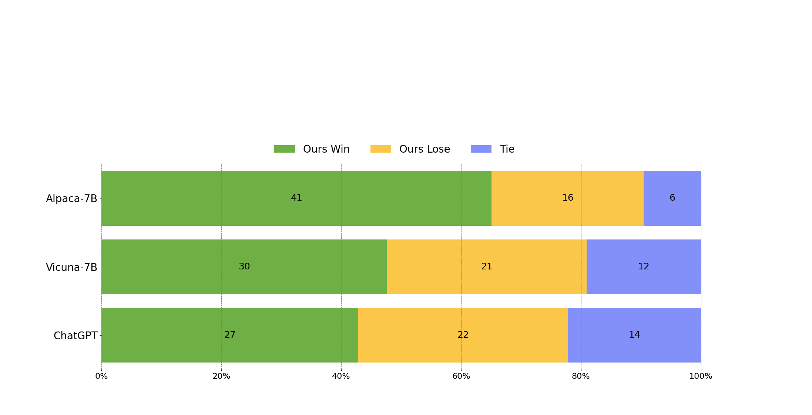

## WizardLM: An Instruction-following LLM Using Evol-Instruct
Empowering Large Pre-Trained Language Models to Follow Complex Instructions

<p align="center" width="100%">
<a ></a>
</p>

[](https://github.com/tatsu-lab/stanford_alpaca/blob/main/LICENSE)
[](https://github.com/tatsu-lab/stanford_alpaca/blob/main/DATA_LICENSE)
[](https://www.python.org/downloads/release/python-390/)

## News

At present, our core contributors are fully engaged in preparing the WizardLM-7B model trained with full evolved instructions (**approximately 300k**). We apologize for any possible delay in responding to your questions.
If you find that the demo is temporarily unavailable, please be patient and **wait a while**. Our contributors regularly check the demo's status and handle any issues.

- 🔥 We released **7B** version of **WizardLM** trained with **70k** evolved instructions. Checkout the [paper](https://arxiv.org/abs/2304.12244) and [demo1](https://6f8173a3550ed441ab.gradio.live) , [demo2](https://261f01fdd31bfe1ca0.gradio.live/)
- &#x1F4E3; We are looking for highly motivated students to join us as interns to create more intelligent AI together. Please contact caxu@microsoft.com

Although on our **complexity-balanced test set**, **WizardLM-7B has more cases that are preferred by human labelers than ChatGPT** in the high-complexity instructions (difficulty level >= 8), it still lags behind ChatGPT on the entire test set, and we also consider WizardLM to still be in a **baby state**. This repository will **continue to improve WizardLM**, train on larger scales, add more training data, and innovate more advanced large-model training methods.

<b>Note for demo usage:</b> Demo 1-4 are all WizardLM-7B. Please use them as evenly as possible to prevent one of them from being too heavy and responding slowly. We only recommend using **English** to experience our model. Support for other languages will be introduced in the future. The demo currently only supports **single-turn** conversation.

## Call for Feedbacks
We welcome everyone to use your professional and difficult instructions to evaluate WizardLM, and show us examples of poor performance and your suggestions in the [issue discussion](https://github.com/nlpxucan/WizardLM/issues) area. We are focusing on improving the Evol-Instruct now and hope to relieve existing weaknesses and issues in the the next version of WizardLM. After that, we will open the code and pipeline of up-to-date Evol-Instruct algorithm and work with you together to improve it.

## Unofficial Video Introductions
Thanks to the enthusiastic friends, their video introductions are more lively and interesting.
1. [GET WizardLM NOW! 7B LLM KING That Can Beat ChatGPT! I'm IMPRESSED!](https://www.youtube.com/watch?v=SaJ8wyKMBds)
2. [WizardLM: Enhancing Large Language Models to Follow Complex Instructions](https://www.youtube.com/watch?v=I6sER-qivYk)

## Case Show
We just sample some cases to demonstrate the performance of WizardLM and ChatGPT on data of varying difficulty, and the details pls refer [Case Show](https://github.com/nlpxucan/WizardLM/blob/main/src/case_show.md).

## Overview of Evol-Instruct

[Evol-Instruct](https://github.com/nlpxucan/evol-instruct) is a novel method using LLMs instead of humans to automatically mass-produce open-domain instructions of various difficulty levels and skills range, to improve the performance of LLMs.

<p align="center" width="100%">
<a ></a>
</p>

<p align="center" width="100%">
<a ></a>
</p>

## Contents

1. [Online Demo](#online-demo)

2. [Training Data](#train_data)

3. [WizardLM Weights](#wizardlm-weights)

4. [Fine-tuning](#finetune)

5. [Inference](#inference)

6. [Evaluation](#evaluation)

7. [Citation](#citation)

8. [Disclaimer](#disclaimer)

## Online Demo

We will provide our latest models for you to try for as long as possible. If you find a link is not working, please try another one. At the same time, please try as many **real-world** and **challenging** problems that you encounter in your work and life as possible. We will continue to evolve our models with your feedbacks.

[Demo Link](https://6f8173a3550ed441ab.gradio.live)

[Demo Backup 1](https://261f01fdd31bfe1ca0.gradio.live/)


## Training Data

[`alpaca_evol_instruct_70k.json`](https://huggingface.co/datasets/victor123/evol_instruct_70k) contains 70K instruction-following data generated from Evol-Instruct. We used it for fine-tuning the WizardLM model.
This JSON file is a list of dictionaries, each dictionary contains the following fields:

- `instruction`: `str`, describes the task the model should perform. Each of the 70K instructions is unique.
- `output`: `str`, the answer to the instruction as generated by `gpt-3.5-turbo`.


## WizardLM Weights
We release [WizardLM] weights as delta weights to comply with the LLaMA model license.
You can add our delta to the original LLaMA weights to obtain the WizardLM weights. Instructions:
1. Get the original LLaMA weights in the huggingface format by following the instructions [here](https://huggingface.co/docs/transformers/main/model_doc/llama).
2. Please download our delta model at the following [link](https://huggingface.co/victor123/WizardLM) 
3. Use the following scripts to get WizardLM weights by applying our delta:
```
python src/weight_diff_wizard.py recover --path_raw <path_to_step_1_dir> --path_diff <path_to_step_2_dir> --path_tuned <path_to_store_recovered_weights>
```

## Fine-tuning

We fine-tune WizardLM using code from [Llama-X](https://github.com/AetherCortex/Llama-X).
We fine-tune LLaMA-7B with the following hyperparameters:

| Hyperparameter | LLaMA-7B |
|----------------|----------|
| Batch size     | 64       |
| Learning rate  | 2e-5     |
| Epochs         | 3        |
| Max length     | 2048     |
| Warmup step    | 2        |
| LR scheduler   | cosine   |

To reproduce our fine-tuning of WizardLM, please follow the following steps:
1. According to the instructions of [Llama-X](https://github.com/AetherCortex/Llama-X), install the environment, download the training code, and deploy.
2. Replace the train.py with the train_freeform.py in our repo(src/train_freeform.py)
3. Execute the following training command:
```bash
deepspeed train_freeform.py \
    --model_name_or_path /path/to/llama-7B/hf \
    --data_path /path/to/alpaca_evol_instruct_70k.json \
    --output_dir /path/to/wizardlm-7B/hf/ft \
    --num_train_epochs 3 \
    --model_max_length 2048 \
    --per_device_train_batch_size 8 \
    --per_device_eval_batch_size 1 \
    --gradient_accumulation_steps 1 \
    --evaluation_strategy "no" \
    --save_strategy "steps" \
    --save_steps 800 \
    --save_total_limit 3 \
    --learning_rate 2e-5 \
    --warmup_steps 2 \
    --logging_steps 2 \
    --lr_scheduler_type "cosine" \
    --report_to "tensorboard" \
    --gradient_checkpointing True \
    --deepspeed configs/deepspeed_config.json \
    --fp16 True
```

## Inference

We provide the decoding script for WizardLM, which reads a input file and generates corresponding responses for each sample, and finally consolidates them into an output file.

You can specify `base_model`, `input_data_path` and `output_data_path` in src\inference_wizardlm.py to set the decoding model, path of input file and path of output file.
The decoding command:
```
python src\inference_wizardlm.py
```

### Evaluation

To evaluate Wizard, we conduct human evaluation on the inputs from our human instruct evaluation set [`WizardLM_testset.jsonl`](./data/WizardLM_testset.jsonl) . This evaluation set was collected by the authors and covers a diverse list of user-oriented instructions including difficult Coding Generation & Debugging, Math, Reasoning, Complex Formats, Academic Writing, Extensive Disciplines, and so on. We performed a blind pairwise comparison between Wizard and baselines. Specifically, we recruit 10 well-educated annotators to rank the models from 1 to 5 on relevance, knowledgeable, reasoning, calculation and accuracy. 

WizardLM achieved significantly better results than Alpaca and Vicuna-7b. 
<p align="center" width="60%">
<a ></a>
</p>

In the high-difficulty section of our test set (difficulty level >= 8), WizardLM even outperforms ChatGPT, with a win rate 7.9% larger than Chatgpt (42.9% vs. 35.0%). This indicates that our method can significantly improve the ability of large language models to handle complex instructions.
<p align="center" width="60%">
<a ></a>
</p>

### Citation

Please cite the repo if you use the data or code in this repo.

```
@misc{xu2023wizardlm,
      title={WizardLM: Empowering Large Language Models to Follow Complex Instructions}, 
      author={Can Xu and Qingfeng Sun and Kai Zheng and Xiubo Geng and Pu Zhao and Jiazhan Feng and Chongyang Tao and Daxin Jiang},
      year={2023},
      eprint={2304.12244},
      archivePrefix={arXiv},
      primaryClass={cs.CL}
}
```
## Disclaimer

The resources, including code, data, and model weights, associated with this project are restricted for academic research purposes only and cannot be used for commercial purposes. The content produced by any version of WizardLM is influenced by uncontrollable variables such as randomness, and therefore, the accuracy of the output cannot be guaranteed by this project. This project does not accept any legal liability for the content of the model output, nor does it assume responsibility for any losses incurred due to the use of associated resources and output results.
