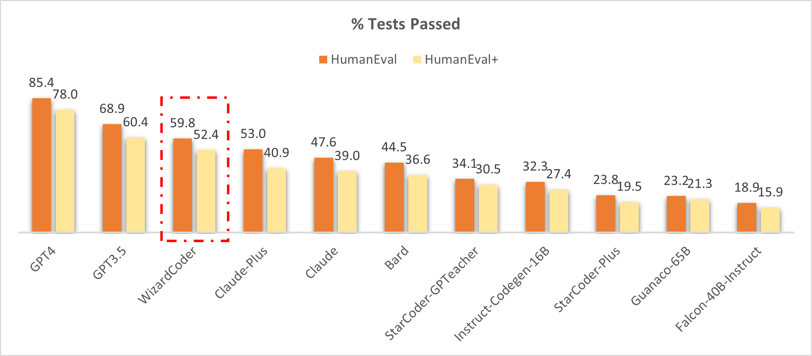

# WizardCoder: Empowering Code Large Language Models with Evol-Instruct

[](CODE_LICENSE)
[](DATA_LICENSE)
[](MODEL_WEIGHTS_LICENSE)
[](https://www.python.org/downloads/release/python-390/)

To develop our WizardCoder model, we begin by adapting the Evol-Instruct method specifically for coding tasks. This involves tailoring the prompt to the domain of code-related instructions. Subsequently, we fine-tune the Code LLM, StarCoder, utilizing the newly created instruction-following training set.

## News

- 🔥 Our **WizardCoder-15B-V1.0** model achieves the **57.3 pass@1** on the [HumanEval Benchmarks](https://github.com/openai/human-eval), which is **22.3** points higher than the SOTA open-source Code LLMs.
- 🔥 We released **WizardCoder-15B-V1.0** trained with **78k** evolved code instructions. Please checkout the [Model Weights](https://huggingface.co/WizardLM/WizardCoder-15B-V1.0), [Demo (Only support code-related English instructions now.)](https://e7e16a48b3ed6f9b.gradio.app/), [Backup Demo1](https://8be3f4e8521d3243.gradio.app/), and [Paper](https://arxiv.org/abs/2306.08568).
- &#x1F4E3; Please refer to our Twitter account https://twitter.com/WizardLM_AI and HuggingFace Repo https://huggingface.co/WizardLM . We will use them to announce any new release at the 1st time. 


## Comparing WizardCoder with the Closed-Source Models.

🔥 The following figure shows that our **WizardCoder attains the third position in this benchmark**, surpassing Claude-Plus (59.8 vs. 53.0) and Bard (59.8 vs. 44.5). Notably, our model exhibits a substantially smaller size compared to these models.

<p align="center" width="100%">
<a ></a>
</p>

❗❗❗**Note: This performance is 100% reproducible! If you cannot reproduce it, please follow the steps in [Evaluation](#evaluation).**

❗**Note: In this study, we copy the scores for HumanEval and HumanEval+ from the [LLM-Humaneval-Benchmarks](https://github.com/my-other-github-account/llm-humaneval-benchmarks). Notably, all the mentioned models generate code solutions for each problem utilizing a **single attempt**, and the resulting pass rate percentage is reported. Our **WizardCoder** generates answers using greedy decoding and tests with the same [code](https://github.com/evalplus/evalplus).**

## Comparing WizardCoder with the Open-Source Models.

The following table clearly demonstrates that our **WizardCoder** exhibits a substantial performance advantage over all the open-source models. ❗**If you are confused with the different scores of our model (57.3 and 59.8), please check the Notes.**


| Model            | HumanEval Pass@1 | MBPP Pass@1 |
|------------------|------------------|-------------|
| CodeGen-16B-Multi| 18.3             |20.9         |
| CodeGeeX         | 22.9             |24.4         |
| LLaMA-33B        | 21.7             |30.2         |
| LLaMA-65B        | 23.7             |37.7         |
| PaLM-540B        | 26.2             |36.8         |
| PaLM-Coder-540B  | 36.0             |47.0         |
| PaLM 2-S         | 37.6             |50.0         |
| CodeGen-16B-Mono | 29.3             |35.3         |
| Code-Cushman-001 | 33.5             |45.9         |
| StarCoder-15B    | 33.6             |43.6*        |
| InstructCodeT5+  | 35.0             |--           |
| WizardLM-30B  1.0| 37.8             |--           |
| WizardCoder-15B  1.0 | **57.3**     |**51.8**     |

❗**Note: The reproduced result of StarCoder on MBPP.**

❗**Note: The above table conducts a comprehensive comparison of our **WizardCoder** with other models on the HumanEval and MBPP benchmarks. We adhere to the approach outlined in previous studies by generating **20 samples** for each problem to estimate the pass@1 score and evaluate with the same [code](https://github.com/openai/human-eval/tree/master). The scores of GPT4 and GPT3.5 reported by [OpenAI](https://openai.com/research/gpt-4) are 67.0 and 48.1 (maybe these are the early version GPT4&3.5).**

## Call for Feedbacks
We welcome everyone to use your professional and difficult instructions to evaluate WizardCoder, and show us examples of poor performance and your suggestions in the [issue discussion](https://github.com/nlpxucan/WizardLM/issues) area. We are focusing on improving the Evol-Instruct now and hope to relieve existing weaknesses and issues in the the next version of WizardCoder. After that, we will open the code and pipeline of up-to-date Evol-Instruct algorithm and work with you together to improve it.

## Unofficial Video Introductions
Thanks to the enthusiastic friends, their video introductions are more lively and interesting.
1. [WizardCoder AI Is The NEW ChatGPT's Coding TWIN!](https://www.youtube.com/watch?v=XjsyHrmd3Xo)

## Contents

1. [Online Demo](#online-demo)

2. [Fine-tuning](#fine-tuning)

3. [Inference](#inference)

4. [Evaluation](#evaluation)

5. [Citation](#citation)

6. [Disclaimer](#disclaimer)

## Online Demo

We will provide our latest models for you to try for as long as possible. If you find a link is not working, please try another one. At the same time, please try as many **real-world** and **challenging** code-related problems that you encounter in your work and life as possible. We will continue to evolve our models with your feedbacks.

[Demo Link](https://e5eaf7d09cc1521c.gradio.app/) (We adopt the greedy decoding now.)

## Fine-tuning

We fine-tune WizardCoder using the modified code `train.py` from [Llama-X](https://github.com/AetherCortex/Llama-X).
We fine-tune StarCoder-15B with the following hyperparameters:

| Hyperparameter | StarCoder-15B |
|----------------|---------------|
| Batch size     | 512           |
| Learning rate  | 2e-5          |
| Epochs         | 3             |
| Max length     | 2048          |
| Warmup step    | 30            |
| LR scheduler   | cosine        |

To reproduce our fine-tuning of WizardCoder, please follow the following steps:
1. According to the instructions of [Llama-X](https://github.com/AetherCortex/Llama-X), install the environment, download the training code, and deploy. (Note: `deepspeed==0.9.2` and `transformers==4.29.2`)
2. Replace the `train.py` with the `train_wizardcoder.py` in our repo (`src/train_wizardcoder.py`)
3. Login Huggingface:
```bash
huggingface-cli login
```
4. Execute the following training command:
```bash
deepspeed train_wizardcoder.py \
    --model_name_or_path "bigcode/starcoder" \
    --data_path "/your/path/to/code_instruction_data.json" \
    --output_dir "/your/path/to/ckpt" \
    --num_train_epochs 3 \
    --model_max_length 2048 \
    --per_device_train_batch_size 16 \
    --per_device_eval_batch_size 1 \
    --gradient_accumulation_steps 4 \
    --evaluation_strategy "no" \
    --save_strategy "steps" \
    --save_steps 50 \
    --save_total_limit 2 \
    --learning_rate 2e-5 \
    --warmup_steps 30 \
    --logging_steps 2 \
    --lr_scheduler_type "cosine" \
    --report_to "tensorboard" \
    --gradient_checkpointing True \
    --deepspeed configs/deepspeed_config.json \
    --fp16 True
```

## Inference

We provide the decoding script for WizardCoder, which reads a input file and generates corresponding responses for each sample, and finally consolidates them into an output file.

You can specify `base_model`, `input_data_path` and `output_data_path` in `src\inference_wizardcoder.py` to set the decoding model, path of input file and path of output file.

```bash
pip install jsonlines
```

The decoding command is:
```
python src\inference_wizardcoder.py \
    --base_model "/your/path/to/ckpt" \
    --input_data_path "/your/path/to/input/data.jsonl" \
    --output_data_path "/your/path/to/output/result.jsonl"
```

The format of `data.jsonl` should be:
```
{"idx": 11, "Instruction": "Write a Python code to count 1 to 10."}
{"idx": 12, "Instruction": "Write a Java code to sum 1 to 10."}
```

The prompt for our WizardCoder in `src\inference_wizardcoder.py` is:
```
Below is an instruction that describes a task. Write a response that appropriately completes the request.

### Instruction:
{instruction}

### Response:
```

## Evaluation

### HumanEval

1. According to the instructions of [HumanEval](https://github.com/openai/human-eval), install the environment.
2. Run the following script to generate the answer.
```bash
model="/path/to/your/model"
temp=0.2
max_len=2048
pred_num=200
num_seqs_per_iter=2

output_path=preds/T${temp}_N${pred_num}

mkdir -p ${output_path}
echo 'Output path: '$output_path
echo 'Model to eval: '$model

# 164 problems, 21 per GPU if GPU=8
index=0
gpu_num=8
for ((i = 0; i < $gpu_num; i++)); do
  start_index=$((i * 21))
  end_index=$(((i + 1) * 21))

  gpu=$((i))
  echo 'Running process #' ${i} 'from' $start_index 'to' $end_index 'on GPU' ${gpu}
  ((index++))
  (
    CUDA_VISIBLE_DEVICES=$gpu python humaneval_gen.py --model ${model} \
      --start_index ${start_index} --end_index ${end_index} --temperature ${temp} \
      --num_seqs_per_iter ${num_seqs_per_iter} --N ${pred_num} --max_len ${max_len} --output_path ${output_path}
  ) &
  if (($index % $gpu_num == 0)); then wait; fi
done
```

3. Run the post processing code `src/process_humaneval.py` to collect the code completions from all answer files.
```bash
output_path=preds/T${temp}_N${pred_num}

echo 'Output path: '$output_path
python process_humaneval.py --path ${output_path} --out_path ${output_path}.jsonl --add_prompt

evaluate_functional_correctness ${output_path}.jsonl
```

### How to Reproduce the 59.8 Pass@1 on HumanEval with Greedy Decoding?

❗❗❗**This performance is 100% reproducible!**

Run the following script to generate the answer with greedy decoding. Then follow the above steps 2 and 3 to get the evaluation result.

❗We also provide the generated codes in `data/humaneval.59.8.gen.zip`

```bash
model="WizardLM/WizardCoder-15B-V1.0"
temp=0.0
max_len=2048
pred_num=1
num_seqs_per_iter=1

output_path=preds/T${temp}_N${pred_num}_WizardCoder_Greedy_Decode

mkdir -p ${output_path}
echo 'Output path: '$output_path
echo 'Model to eval: '$model

# 164 problems, 21 per GPU if GPU=8
index=0
gpu_num=8
for ((i = 0; i < $gpu_num; i++)); do
  start_index=$((i * 21))
  end_index=$(((i + 1) * 21))

  gpu=$((i))
  echo 'Running process #' ${i} 'from' $start_index 'to' $end_index 'on GPU' ${gpu}
  ((index++))
  (
    CUDA_VISIBLE_DEVICES=$gpu python humaneval_gen.py --model ${model} \
      --start_index ${start_index} --end_index ${end_index} --temperature ${temp} \
      --num_seqs_per_iter ${num_seqs_per_iter} --N ${pred_num} --max_len ${max_len} --output_path ${output_path} --greedy_decode
  ) &
  if (($index % $gpu_num == 0)); then wait; fi
done
```

### MBPP

1. Run the following script to generate the answer.
```bash
model="/path/to/your/model"
temp=0.2
max_len=2048
pred_num=200
num_seqs_per_iter=2

output_path=preds/MBPP_T${temp}_N${pred_num}
mbpp_path=data/mbpp.test.jsonl # we provide this file in data/mbpp.test.zip

mkdir -p ${output_path}
echo 'Output path: '$output_path
echo 'Model to eval: '$model

# 500 problems, 63 per GPU if GPU=8
index=0
gpu_num=8
for ((i = 0; i < $gpu_num; i++)); do
  start_index=$((i * 50))
  end_index=$(((i + 1) * 50))

  gpu=$((i))
  echo 'Running process #' ${i} 'from' $start_index 'to' $end_index 'on GPU' ${gpu}
  ((index++))
  (
    CUDA_VISIBLE_DEVICES=$gpu python mbpp_gen.py --model ${model} \
      --start_index ${start_index} --end_index ${end_index} --temperature ${temp} \
      --num_seqs_per_iter ${num_seqs_per_iter} --N ${pred_num} --max_len ${max_len} --output_path ${output_path} --mbpp_path ${mbpp_path}
  ) &
  if (($index % $gpu_num == 0)); then wait; fi
done
```

3. Run the post processing code `src/process_mbpp.py` to collect the code completions from all answer files.
```bash
output_path=preds/MBPP_T${temp}_N${pred_num}
mbpp_path=data/mbpp.test.jsonl # we provide this file in data/mbpp.test.zip

echo 'Output path: '$output_path
python process_mbpp.py --path ${output_path} --out_path ${output_path}.jsonl --mbpp_path ${mbpp_path} --add_prompt
```

4. Evaluate the `MBPP_T${temp}_N${pred_num}.jsonl` with [bigcode-evaluation-harness](https://github.com/bigcode-project/bigcode-evaluation-harness).

Acknowledgement: The evaluation code `humaneval_gen.py`, `mbpp_gen.py` and bash scripts are modified from the great works of [CodeT5](https://github.com/salesforce/CodeT5).

## Citation

Please cite the repo if you use the data or code in this repo.

```
@misc{luo2023wizardcoder,
      title={WizardCoder: Empowering Code Large Language Models with Evol-Instruct}, 
      author={Ziyang Luo and Can Xu and Pu Zhao and Qingfeng Sun and Xiubo Geng and Wenxiang Hu and Chongyang Tao and Jing Ma and Qingwei Lin and Daxin Jiang},
      year={2023},
      eprint={2306.08568},
      archivePrefix={arXiv},
      primaryClass={cs.CL}
}
```
## Disclaimer

The resources, including code, data, and model weights, associated with this project are restricted for **academic research purposes only** and **cannot be used for commercial purposes**. The content produced by any version of WizardCoder is influenced by uncontrollable variables such as randomness, and therefore, the accuracy of the output cannot be guaranteed by this project. This project does not accept any legal liability for the content of the model output, nor does it assume responsibility for any losses incurred due to the use of associated resources and output results.

## Star History

[](https://star-history.com/#nlpxucan/WizardLM&Timeline)

