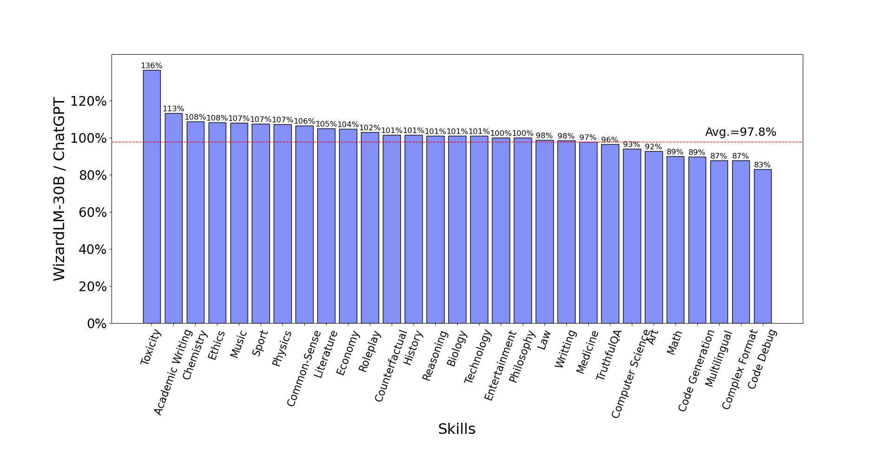
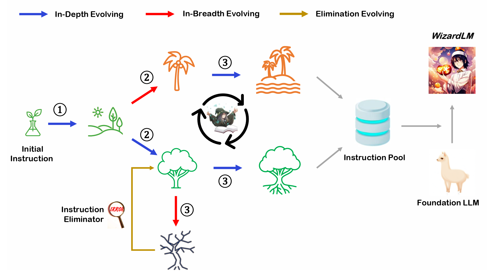
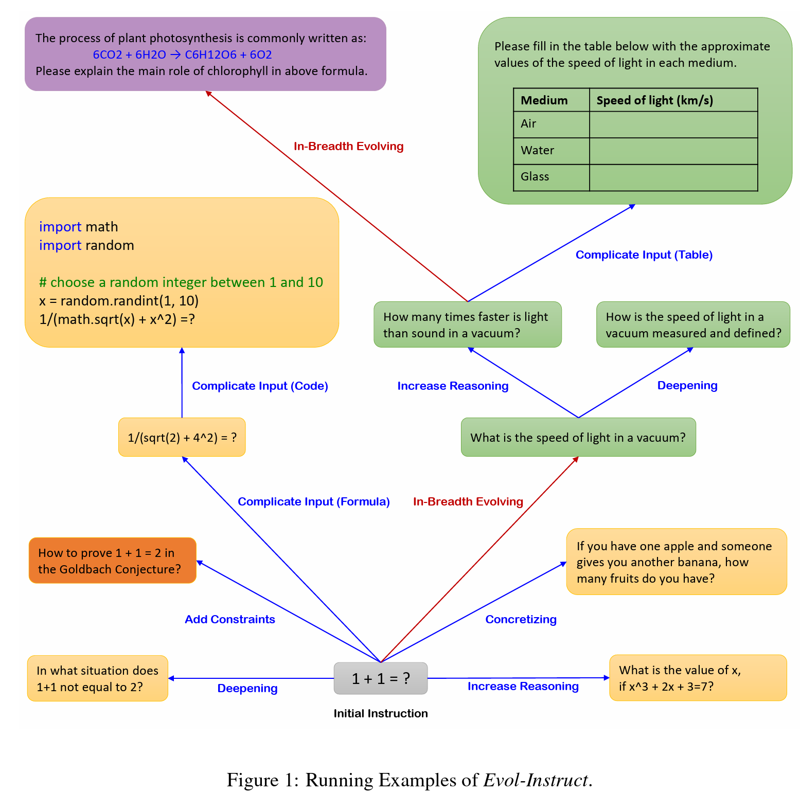

## WizardLM: An Instruction-following LLM Using Evol-Instruct 
Empowering Large Pre-Trained Language Models to Follow Complex Instructions

<p align="center" width="100%">
<a ></a>
</p>

[](CODE_LICENSE)
[](DATA_LICENSE)
[](MODEL_DIFF_LICENSE)
[](https://www.python.org/downloads/release/python-390/)

## News

At present, our core contributors are preparing the **65B** version and we expect to empower WizardLM with the ability to perform instruction evolution itself, aiming to evolve your specific data at a low cost.

- 🔥 Our WizardLM-13B-V1.0 model achieves the 1st-rank of the opensource models on the [AlpacaEval Leaderboard](https://tatsu-lab.github.io/alpaca_eval/).
- &#x1F4E3; Please refer to our Twitter account https://twitter.com/WizardLM_AI and HuggingFace Repo https://huggingface.co/WizardLM . We will use them to announce any new release at the 1st time. 
- 🔥 We released  **WizardLM-30B-V1.0** ([Demo_30B](https://4919f66f0be2b1f0.gradio.app), [Demo_30B_bak](https://243d23ffb61204d1.gradio.app)) and **WizardLM-13B-V1.0** ([Demo_13B](https://88149bd2f5b409bd.gradio.app)) trained with **250k** evolved instructions (from ShareGPT), and **WizardLM-7B-V1.0** ([Demo_7B](https://74ecfd89dccaaa08.gradio.app)) trained with **70k** evolved instructions (from Alpaca data). Please checkout the [Delta Weights](https://huggingface.co/WizardLM) and [paper](https://arxiv.org/abs/2304.12244).

- &#x1F4E3; We are looking for highly motivated students to join us as interns to create more intelligent AI together. Please contact caxu@microsoft.com

<!-- Although on our **complexity-balanced test set**, **WizardLM-7B has more cases that are preferred by human labelers than ChatGPT** in the high-complexity instructions (difficulty level >= 8), it still lags behind ChatGPT on the entire test set, and we also consider WizardLM to still be in a **baby state**. This repository will **continue to improve WizardLM**, train on larger scales, add more training data, and innovate more advanced large-model training methods. -->


<b>Note for 30B and 13B model usage:</b>

To obtain results **identical to our demo**, please strictly follow the prompts and invocation methods provided in the **"src/infer_wizardlm13b.py"** to use our 13B model for inference. Unlike the 7B model, the 13B model adopts the prompt format from <b>Vicuna</b> and supports **multi-turn** conversation.

<b>For WizardLM-13B-V1.0, WizardLM-30B-V1.0 </b>, the Prompt should be as following:

```
A chat between a curious user and an artificial intelligence assistant. The assistant gives helpful, detailed, and polite answers to the user's questions. USER: hello, who are you? ASSISTANT: 
```

<b>For WizardLM-7B-V1.0 </b>, the Prompt should be as following:

```
"{instruction}\n\n### Response:"
```

### GPT-4 automatic evaluation

We adopt the automatic evaluation framework based on GPT-4 proposed by FastChat to assess the performance of chatbot models. As shown in the following figure, WizardLM-30B achieved better results than Guanaco-65B. 
<p align="center" width="100%">
<a ></a>
</p>

### WizardLM-30B performance on different skills.

The following figure compares WizardLM-30B and ChatGPT’s skill on Evol-Instruct testset. The result indicates that WizardLM-30B achieves 97.8% of ChatGPT’s performance on average, with almost 100% (or more than) capacity on 18 skills, and more than 90% capacity on 24 skills.

<p align="center" width="100%">
<a ></a>
</p>

### WizardLM performance on NLP foundation tasks.

The following table provides a comparison of WizardLMs and other LLMs on NLP foundation tasks. The results indicate that WizardLMs consistently exhibit superior performance in comparison to the LLaMa models of the same size. Furthermore, our WizardLM-30B model showcases comparable performance to OpenAI's Text-davinci-003 on the MMLU and HellaSwag benchmarks.

| Model            | MMLU 5-shot | ARC 25-shot | TruthfulQA 0-shot | HellaSwag 10-shot | Average    |
|------------------|-------------|-------------|-------------------|-------------------|------------|
| Text-davinci-003 | <u>56.9<u/> | **85.2**    | **59.3**          | <u>82.2<u/>       | **70.9**   |
|Vicuna-13b 1.1   | 51.3        | 53.0        | 51.8              | 80.1              | 59.1       |
|Guanaco 30B   | 57.6        | 63.7        | 50.7              | **85.1**              | 64.3       |   
| WizardLM-7B 1.0      | 42.7        | 51.6        | 44.7              | 77.7              | 54.2       |
| WizardLM-13B 1.0     | 52.3        | 57.2        | 50.5              | 81.0              | 60.2       |
| WizardLM-30B 1.0    | **58.8**    | <u>62.5<u/> | <u>52.4<u/>       | 83.3          | <u>64.2<u/>|

### WizardLM performance on code generation.

The following table provides a comprehensive comparison of WizardLMs and several other LLMs on the code generation task, namely HumanEval. The evaluation metric is pass@1. The results indicate that WizardLMs consistently exhibit superior performance in comparison to the LLaMa models of the same size. Furthermore, our WizardLM-30B model surpasses StarCoder and OpenAI's code-cushman-001.


| Model            | HumanEval Pass@1 |
|------------------|------------------|
| LLaMA-7B         | 10.5             |
| LLaMA-13B        | 15.8             |
| CodeGen-16B-Multi| 18.3             |
| CodeGeeX         | 22.9             |
| LLaMA-33B        | 21.7             |
| LLaMA-65B        | 23.7             |
| PaLM-540B        | 26.2             |
| CodeGen-16B-Mono | 29.3             |
| code-cushman-001 | 33.5             |
| StarCoder        | <u>33.6<u/>      |
| WizardLM-7B 1.0      | 19.1             |
| WizardLM-13B 1.0     | 24.0             |
| WizardLM-30B  1.0   | **37.8**         |

## Call for Feedbacks
We welcome everyone to use your professional and difficult instructions to evaluate WizardLM, and show us examples of poor performance and your suggestions in the [issue discussion](https://github.com/nlpxucan/WizardLM/issues) area. We are focusing on improving the Evol-Instruct now and hope to relieve existing weaknesses and issues in the the next version of WizardLM. After that, we will open the code and pipeline of up-to-date Evol-Instruct algorithm and work with you together to improve it.

## Unofficial Video Introductions
Thanks to the enthusiastic friends, their video introductions are more lively and interesting.
1. [GET WizardLM NOW! 7B LLM KING That Can Beat ChatGPT! I'm IMPRESSED!](https://www.youtube.com/watch?v=SaJ8wyKMBds)
2. [WizardLM: Enhancing Large Language Models to Follow Complex Instructions](https://www.youtube.com/watch?v=I6sER-qivYk)

## Case Show
We just sample some cases to demonstrate the performance of WizardLM and ChatGPT on data of varying difficulty, and the details pls refer [Case Show](https://github.com/nlpxucan/WizardLM/blob/main/src/case_show.md).

## Overview of Evol-Instruct

[Evol-Instruct](https://github.com/nlpxucan/evol-instruct) is a novel method using LLMs instead of humans to automatically mass-produce open-domain instructions of various difficulty levels and skills range, to improve the performance of LLMs.

<p align="center" width="100%">
<a ></a>
</p>

<p align="center" width="100%">
<a ></a>
</p>

## Contents

1. [Online Demo](#online-demo)

2. [Training Data](#training-data)

3. [WizardLM Weights](#wizardlm-weights)

4. [Fine-tuning](#fine-tuning)

5. [Distributed Fine-tuning](#distributed-Fine-tuning)

6. [Inference](#inference)

7. [Evaluation](#evaluation)

8. [Citation](#citation)

9. [Disclaimer](#disclaimer)

## Online Demo

We will provide our latest models for you to try for as long as possible. If you find a link is not working, please try another one. At the same time, please try as many **real-world** and **challenging** problems that you encounter in your work and life as possible. We will continue to evolve our models with your feedbacks.

[Demo Link](https://011fc8477ad734d7.gradio.app)

[Demo Backup 1](https://1825e531c43a23c7.gradio.app)


## Training Data

[`alpaca_evol_instruct_70k.json`](https://huggingface.co/datasets/victor123/evol_instruct_70k) contains 70K instruction-following data generated from Evol-Instruct. We used it for fine-tuning the WizardLM model.
This JSON file is a list of dictionaries, each dictionary contains the following fields:

- `instruction`: `str`, describes the task the model should perform. Each of the 70K instructions is unique.
- `output`: `str`, the answer to the instruction as generated by `gpt-3.5-turbo`.


## WizardLM Weights
We release [WizardLM] weights as delta weights to comply with the LLaMA model license.
You can add our delta to the original LLaMA weights to obtain the WizardLM weights. Instructions:
1. Get the original LLaMA weights in the huggingface format by following the instructions [here](https://huggingface.co/docs/transformers/main/model_doc/llama).
2. Please download our delta model at the following [link](https://huggingface.co/victor123/WizardLM) 
3. Use the following scripts to get WizardLM weights by applying our delta:
```
python src/weight_diff_wizard.py recover --path_raw <path_to_step_1_dir> --path_diff <path_to_step_2_dir> --path_tuned <path_to_store_recovered_weights>
```

## Fine-tuning

We fine-tune WizardLM using code from [Llama-X](https://github.com/AetherCortex/Llama-X).
We fine-tune LLaMA-7B and LLaMA-13B with the following hyperparameters:

| Hyperparameter | LLaMA-7B | LLaMA-13B|
|----------------|----------|----------|
| Batch size     | 64       | 384      |
| Learning rate  | 2e-5     | 2e-5     |
| Epochs         | 3        | 3        |
| Max length     | 2048     | 2048     |
| Warmup step    | 2        | 50       |
| LR scheduler   | cosine   | cosine   |

To reproduce our fine-tuning of WizardLM, please follow the following steps:
1. According to the instructions of [Llama-X](https://github.com/AetherCortex/Llama-X), install the environment, download the training code, and deploy.
2. Replace the train.py with the train_freeform.py in our repo(src/train_freeform.py)
3. Execute the following training command:
```bash
deepspeed train_freeform.py \
    --model_name_or_path /path/to/llama-7B/hf \
    --data_path /path/to/alpaca_evol_instruct_70k.json \
    --output_dir /path/to/wizardlm-7B/hf/ft \
    --num_train_epochs 3 \
    --model_max_length 2048 \
    --per_device_train_batch_size 8 \
    --per_device_eval_batch_size 1 \
    --gradient_accumulation_steps 1 \
    --evaluation_strategy "no" \
    --save_strategy "steps" \
    --save_steps 800 \
    --save_total_limit 3 \
    --learning_rate 2e-5 \
    --warmup_steps 2 \
    --logging_steps 2 \
    --lr_scheduler_type "cosine" \
    --report_to "tensorboard" \
    --gradient_checkpointing True \
    --deepspeed configs/deepspeed_config.json \
    --fp16 True
```

## Distributed Fine-tuning
See [Distributed Fine-tuning](./doc/distributed_finetune.md)

## Inference

**NOTE:** The **WizardLM-13B-1.0** and **Wizard-7B** use different prompt at the beginning of the conversation!

We provide the decoding script for WizardLM, which reads a input file and generates corresponding responses for each sample, and finally consolidates them into an output file.

You can specify `base_model`, `input_data_path` and `output_data_path` in src\inference_wizardlm.py or src\infer_wizardlm13b.py to set the decoding model, path of input file and path of output file.


<b>For WizardLM-13B-1.0 </b>, the Prompt should be as following:

```
A chat between a curious user and an artificial intelligence assistant. The assistant gives helpful, detailed, and polite answers to the user's questions. USER: hello, who are you? ASSISTANT: 
```

The decoding command of 13B model:
```
python src/infer_wizardlm13b.py
```

<b>For WizardLM-7B </b>, the Prompt should be as following:

```
"{instruction}\n\n### Response:"
```

The decoding command of 7B model:
```
python src\inference_wizardlm.py
```


### Evaluation

To evaluate Wizard, we conduct human evaluation on the inputs from our human instruct evaluation set [`WizardLM_testset.jsonl`](./data/WizardLM_testset.jsonl) . This evaluation set was collected by the authors and covers a diverse list of user-oriented instructions including difficult Coding Generation & Debugging, Math, Reasoning, Complex Formats, Academic Writing, Extensive Disciplines, and so on. We performed a blind pairwise comparison between Wizard and baselines. Specifically, we recruit 10 well-educated annotators to rank the models from 1 to 5 on relevance, knowledgeable, reasoning, calculation and accuracy. 

WizardLM achieved significantly better results than Alpaca and Vicuna-7b. 
<p align="center" width="60%">
<a ></a>
</p>

In the high-difficulty section of our test set (difficulty level >= 8), WizardLM even outperforms ChatGPT, with a win rate 7.9% larger than Chatgpt (42.9% vs. 35.0%). This indicates that our method can significantly improve the ability of large language models to handle complex instructions.
<p align="center" width="60%">
<a ></a>
</p>

### Citation

Please cite the repo if you use the data or code in this repo.

```
@misc{xu2023wizardlm,
      title={WizardLM: Empowering Large Language Models to Follow Complex Instructions}, 
      author={Can Xu and Qingfeng Sun and Kai Zheng and Xiubo Geng and Pu Zhao and Jiazhan Feng and Chongyang Tao and Daxin Jiang},
      year={2023},
      eprint={2304.12244},
      archivePrefix={arXiv},
      primaryClass={cs.CL}
}
```
## Disclaimer

The resources, including code, data, and model weights, associated with this project are restricted for academic research purposes only and cannot be used for commercial purposes. The content produced by any version of WizardLM is influenced by uncontrollable variables such as randomness, and therefore, the accuracy of the output cannot be guaranteed by this project. This project does not accept any legal liability for the content of the model output, nor does it assume responsibility for any losses incurred due to the use of associated resources and output results.

## Star History

[](https://star-history.com/#nlpxucan/WizardLM&Timeline)

