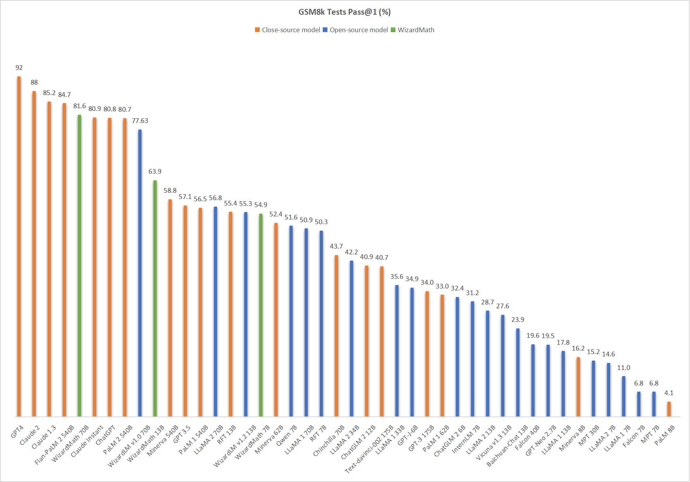

# WizardMath : Empowering Mathematical Reasoning for Large Language Models via Reinforced Evol-Instruct (RLEIF)

[](CODE_LICENSE)
[](DATA_LICENSE)
[](WizardMath/LICENSE)
[](https://www.python.org/downloads/release/python-390/)


<p align="center">
🤗 <a href="https://huggingface.co/WizardLM" target="_blank">HF Repo</a> • 🐦 <a href="https://twitter.com/WizardLM_AI" target="_blank">Twitter</a> • 📃 <a href="https://arxiv.org/abs/2304.12244" target="_blank">[WizardLM]</a>  • 📃 <a href="https://arxiv.org/abs/2306.08568" target="_blank">[WizardCoder]</a>     • 📃 <a href="https://arxiv.org/abs/2308.09583" target="_blank">[WizardMath]</a><br>
</p>
<p align="center">
    👋 Join our <a href="https://discord.gg/VZjjHtWrKs" target="_blank">Discord</a>
</p>

<p align="center" width="100%">
<a ></a>
</p>

To develop our WizardMath model, we begin with adapting the **Evol-Instruct** and **Reinforcement Learning methods** specifically for math tasks, like GSM8k and MATH. This involves tailoring the prompt to the domain of math-related instructions. Subsequently, we fine-tune the LLaMA 2, utilizing the newly created instruction-following math training set.

    
## News

- [12/19/2023] 🔥 We released **WizardMath-7B-V1.1** trained from Mistral-7B, the **SOTA 7B math LLM**, achieves **83.2 pass@1** on GSM8k, and **33.0 pass@1** on MATH.

- [12/19/2023] 🔥 **WizardMath-7B-V1.1** outperforms **ChatGPT 3.5**, **Gemini Pro**, **Mixtral MOE**, and **Claude Instant** on GSM8K pass@1.

- [12/19/2023] 🔥 **WizardMath-7B-V1.1** is comparable with **ChatGPT 3.5**, **Gemini Pro**, and surpasses **Mixtral MOE** on MATH pass@1.


- 🔥 Our **WizardMath-70B-V1.0** model slightly outperforms some closed-source LLMs on the GSM8K, including **ChatGPT 3.5**, **Claude Instant 1** and **PaLM 2 540B**.
- 🔥 Our **WizardMath-70B-V1.0** model achieves  **81.6 pass@1** on the [GSM8k Benchmarks](https://github.com/openai/grade-school-math), which is **24.8** points higher than the SOTA open-source LLM.
- 🔥 Our **WizardMath-70B-V1.0** model achieves  **22.7 pass@1** on the [MATH Benchmarks](https://github.com/hendrycks/math), which is **9.2** points higher than the SOTA open-source LLM.

| Model | Checkpoint | Paper  | GSM8k | MATH  |
| ----- |------| ---- |------|-------| 
| **WizardMath-7B-V1.1** | 🤗 <a href="https://huggingface.co/WizardLM/WizardMath-7B-V1.1" target="_blank">HF Link</a>  |  📃 <a href="https://arxiv.org/abs/2308.09583" target="_blank">[WizardMath]</a>| 	 **83.2**  |  **33.0** | 
| WizardMath-70B-V1.0 | 🤗 <a href="https://huggingface.co/WizardLM/WizardMath-70B-V1.0" target="_blank">HF Link</a> |  📃 <a href="https://arxiv.org/abs/2308.09583" target="_blank">[WizardMath]</a>| **81.6**  |  **22.7**	|
| WizardMath-13B-V1.0 | 🤗 <a href="https://huggingface.co/WizardLM/WizardMath-13B-V1.0" target="_blank">HF Link</a> |  📃 <a href="https://arxiv.org/abs/2308.09583" target="_blank">[WizardMath]</a>| **63.9**  |  **14.0** |
| WizardMath-7B-V1.0 | 🤗 <a href="https://huggingface.co/WizardLM/WizardMath-7B-V1.0" target="_blank">HF Link</a>  |  📃 <a href="https://arxiv.org/abs/2308.09583" target="_blank">[WizardMath]</a>| 	 **54.9**  |  **10.7** |       

## [12/19/2023] Comparing WizardMath-7B-V1.1 with other open source 7B size math LLMs.

| Model | GSM8k Pass@1 | MATH Pass@1 |
| ----- |------| ---- |
| MPT-7B              | 6.8          | 3.0         |
|Llama 1-7B          | 11.0         | 2.9         |
|Llama 2-7b|12.3	|2.8	|
|Yi-6b| 32.6	|5.8	|
|Mistral-7b|37.8	|9.1	|
|Qwen-7b|47.8	|9.3	|
| RFT-7B              | 50.3         | --          |
| MAmmoTH-7B (COT)    | 50.5         | 10.4        |
| WizardMath-7B-V1.0 | 54.9  |  10.7 |
|Abel-7B-001 |59.7	|13	|
| MetaMath-7B         | 66.5         | 19.8        |
| Arithmo-Mistral-7B  | 74.7         | 25.3        |
|MetaMath-Mistral-7B|77.7	|28.2	|
|Abel-7B-002 |	80.4 | 29.5	|
| **WizardMath-7B-V1.1** |  **83.2**  |  **33.0** |


## [12/19/2023] Comparing WizardMath-7B-V1.1 with large open source (30B~70B) LLMs.

| Model | GSM8k Pass@1 | MATH Pass@1 |
| ----- |------| ---- |
| Llemma-34B             | 51.5          |   25.0       |
| Minerva-62B             | 52.4          |  27.6        |
| Llama 2-70B             | 56.8          |  13.5        |
|  DeepSeek 67B            | 63.4          |  --        |
|  Gork 33B            | 62.9          |  23.9       |
| MAmmoTH-70B             | 72.4          |  21.1       |
| Yi-34B            | 67.9          |   15.9       |
| Mixtral 8x7B            | 74.4          |   28.4      |
|  MetaMath-70B  | 82.3          |   26.6       |
| **WizardMath-7B-V1.1** |  **83.2**  |  **33.0** |

   
 ## ❗ Data Contamination Check:

Before model training, we carefully and rigorously checked all the training data, and used multiple deduplication methods to verify and prevent data leakage on GSM8k and MATH test set. 
                                                                           
                                                                                                                                                                                                                                                                                                                                                                           

## Comparing WizardMath V1.0 with the LLM models.

🔥 The following figure shows that our **WizardMath attains the fifth position on the GSM8k benchmark**, surpassing **Claude Instant 1 (81.6 vs. 80.9), ChatGPT (81.6 vs. 80.8) and PaLM 2 540B (81.6 vs. 80.7)**. Notably, our model exhibits a substantially smaller size compared to these models.

<p align="center" width="100%">
<a ></a>
</p>

❗❗❗**Note: This performance is 100% reproducible! If you cannot reproduce it, please follow the steps in [Evaluation](#evaluation).**

❗❗❗**Note: The score of ChatGPT reported by [Model Selection](https://arxiv.org/pdf/2305.14333v1.pdf) is 80.8%.**

❗❗❗**Note: If you want to build a WizardMath demo, note for model system prompts usage:**

**Default version:**

```
"Below is an instruction that describes a task. Write a response that appropriately completes the request.\n\n### Instruction:\n{instruction}\n\n### Response:"
```


**CoT Version:** （❗For the **simple** math questions, we do NOT recommend to use the CoT prompt.） 


```
"Below is an instruction that describes a task. Write a response that appropriately completes the request.\n\n### Instruction:\n{instruction}\n\n### Response: Let's think step by step."
```


The following table clearly demonstrates that our **WizardMath** exhibits a substantial performance advantage over all the open-source models on the GSM8k and MATH benchmarks. 

❗ **If you are confused with the different scores of our 7B, 13B and 70B models (54.9, 63.9 and 81.6), please check the Notes.**


| Model               | GSM8k Pass@1 | MATH Pass@1 |
|---------------------|--------------|-------------|
| MPT-7B              | 6.8          | 3.0         |
| Falcon-7B           | 6.8          | 2.3         |
| LLaMA-1-7B          | 11.0         | 2.9         |
| LLaMA-2-7B          | 14.6         | 2.5         |
| MPT-30B             | 15.2         | 3.1         |
| LLaMA-1-13B         | 17.8         | 3.9         |
| GPT-Neo-2.7B        | 19.5         | --          |
| Falcon-40B          | 19.6         | 2.5         |
| Baichuan-chat-13B   | 23.9         | --          |
| Vicuna-v1.3-13B     | 27.6         | --          |
| LLaMA-2-13B         | 28.7         | 3.9         |
| InternLM-7B         | 31.2         | --          |
| ChatGLM-2-6B        | 32.4         | --          |
| GPT-J-6B            | 34.9         | --          |
| LLaMA-1-33B         | 35.6         | 3.9         |
| LLaMA-2-34B         | 42.2         | 6.24        |
| RFT-7B              | 50.3         | --          |
| LLaMA-1-65B         | 50.9         | 10.6        |
| Qwen-7B             | 51.6         | --          |
| WizardMath-7B-v1.0  | **54.9**     | **10.7**    |
| LLaMA-2-70B         | 56.8         | 13.5        |
| WizardMath-13B-v1.0 | **63.9**     | **14.0**    |
| WizardMath-70B-v1.0 | **81.6**     | **22.7**    |


❗ **Note: The above table conducts a comprehensive comparison of our **WizardMath** with other models on the GSM8k and MATH benchmarks. In this study, to ensure equitable and cohesive evaluations, we report the socres of all models within the settings of greedy decoding and CoT.**

## Contents


1. [Training](#training)

2. [Inference](#inference)

3. [Evaluation](#evaluation)

4. [Citation](#citation)

5. [Disclaimer](#disclaimer)

<h2 id="training">Training</h2>

### Supervised fine-tuning

In the SFT stage, we train WizardMath with the code `WizardMath/train/train_wizardmath.py` from [Llama-X](https://github.com/AetherCortex/Llama-X), which uses the open-source friendly [](https://github.com/tatsu-lab/stanford_alpaca/blob/main/LICENSE).
We supervised fine-tune WizardMath-13B with the following hyperparameters:

| Hyperparameter | LLaMA 2 13B |
|----------------|-------------|
| Batch size     | 128         |
| Learning rate  | 2e-5        |
| Epochs         | 3           |
| Max length     | 2048        |
| LR scheduler   | cosine      |

To reproduce our fine-tuning of WizardMath, please follow the following steps:
1. According to the instructions of [Llama-X](https://github.com/AetherCortex/Llama-X), install the environment, download the training code, and deploy. (Note: `deepspeed==0.10.0` and `transformers==4.31.0`)
2. Replace the `train.py` with the `train_wizardmath.py` in our repo (`WizardMath/train/train_wizardmath.py`)
3. Login Huggingface:
```bash
huggingface-cli login
```
4. Execute the following training command:
```bash
deepspeed train_wizardmath.py \
    --model_name_or_path "/your/path/to/llama-2-13b" \
    --data_path  "/your/path/to/math_instruction_data.json"\
    --output_dir  "/your/path/to/save_ckpt"\
    --num_train_epochs 3 \
    --model_max_length 2048 \
    --per_device_train_batch_size 16 \
    --per_device_eval_batch_size 1 \
    --gradient_accumulation_steps 1 \
    --evaluation_strategy "no" \
    --save_strategy "steps" \
    --save_steps 50 \
    --save_total_limit 50 \
    --learning_rate 2e-5 \
    --warmup_steps 10 \
    --logging_steps 2 \
    --lr_scheduler_type "cosine" \
    --report_to "tensorboard" \
    --gradient_checkpointing True \
    --deepspeed config/deepspeed_config.json \
    --fp16 True \
```
### RL training

Recently, there have been clear changes in the open-source policy and regulations of our overall organization's code, data, and models. The data and code involves stricter auditing and is in review with our legal team . Our researchers have no authority to publicly release them without authorization. Thank you for your understanding.


<h2 id="inference">Inference</h2>

We provide the decoding script for WizardMath, which reads an input file and generates corresponding responses for each sample, and finally calculate the score.

###  Install inference environment :
Note: We used vllm for inference which can speed up inference and save time. Please refer to the official github [vllm](https://github.com/vllm-project/vllm/tree/main) for questions about vllm installation.
```bash
conda create -n wizardmath python=3.8 -y
conda activate wizardmath
pip install vllm
pip install jsonlines
pip install Fraction
pip install openai
cd WizardMath
```

<h2 id="evaluation">Evaluation</h2>

The inference prompt for our WizardMath is:
```
"Below is an instruction that describes a task. Write a response that appropriately completes the request.\n\n### Instruction:\n{instruction}\n\n### Response: Let's think step by step."
```


### GSM8k benchmarks

1. The format of `gsm8k_test.jsonl` should be:
```
{"question": "Janet\u2019s ducks lay 16 eggs per day. She eats three for breakfast every morning and bakes muffins for her friends every day with four. She sells the remainder at the farmers' market daily for $2 per fresh duck egg. How much in dollars does she make every day at the farmers' market?", "answer": "Janet sells 16 - 3 - 4 = <<16-3-4=9>>9 duck eggs a day.\nShe makes 9 * 2 = $<<9*2=18>>18 every day at the farmer\u2019s market.\n#### 18"}
{"question": "A robe takes 2 bolts of blue fiber and half that much white fiber.  How many bolts in total does it take?", "answer": "It takes 2/2=<<2/2=1>>1 bolt of white fiber\nSo the total amount of fabric is 2+1=<<2+1=3>>3 bolts of fabric\n#### 3"}
{"question": "Josh decides to try flipping a house.  He buys a house for $80,000 and then puts in $50,000 in repairs.  This increased the value of the house by 150%.  How much profit did he make?", "answer": "The cost of the house and repairs came out to 80,000+50,000=$<<80000+50000=130000>>130,000\nHe increased the value of the house by 80,000*1.5=<<80000*1.5=120000>>120,000\nSo the new value of the house is 120,000+80,000=$<<120000+80000=200000>>200,000\nSo he made a profit of 200,000-130,000=$<<200000-130000=70000>>70,000\n#### 70000"}
{"question": "James decides to run 3 sprints 3 times a week.  He runs 60 meters each sprint.  How many total meters does he run a week?", "answer": "He sprints 3*3=<<3*3=9>>9 times\nSo he runs 9*60=<<9*60=540>>540 meters\n#### 540"}
.....
```

2. Run the following script to generate the answer.
```bash
python inference/gsm8k_inference.py --data_file data/gsm8k_test.jsonl --model "/your/path/to/load_ckpt" --batch_size 60 --tensor_parallel_size 1
```
You can specify `tensor_parallel_size` , which indicates the number of gpus. You are able to slice the datasets using the `start` and `end`.


### MATH benchmarks

1. The format of `MATH_test.jsonl` should be:
```
{"idx": "hendrycks_math_1", "instruction": "Find the matrix $\\mathbf{M}$ such that\n\\[\\mathbf{M} \\begin{pmatrix} 1 & -2 \\\\ 1 & 4 \\end{pmatrix} = \\begin{pmatrix} 6 & 0 \\\\ 0 & 6 \\end{pmatrix}.\\]", "output": "The inverse of $\\begin{pmatrix} 1 & -2 \\\\ 1 & 4 \\end{pmatrix}$ is\n\\[\\frac{1}{(1)(4) - (-2)(1)} \\begin{pmatrix} 4 & 2 \\\\ -1 & 1 \\end{pmatrix} = \\frac{1}{6} \\begin{pmatrix} 4 & 2 \\\\ -1 & 1 \\end{pmatrix}.\\]So, multiplying by this inverse on the right, we get\n\\[\\mathbf{M} = \\begin{pmatrix} 6 & 0 \\\\ 0 & 6 \\end{pmatrix} \\cdot \\frac{1}{6} \\begin{pmatrix} 4 & 2 \\\\ -1 & 1 \\end{pmatrix} = \\boxed{\\begin{pmatrix} 4 & 2 \\\\ -1 & 1 \\end{pmatrix}}.\\]", "input": "", "type": "Precalculus"}
{"idx": "hendrycks_math_2", "instruction": "Compute $\\arccos (-1).$  Express your answer in radians.", "output": "Since $\\cos \\pi = -1,$ $\\arccos (-1) = \\boxed{\\pi}.$", "input": "", "type": "Precalculus"}
.....
```

2. Run the following script to generate the answer.
```bash
python inference/MATH_inference.py --data_file data/MATH_test.jsonl --model "/your/path/to/load_ckpt" --batch_size 50 --tensor_parallel_size 1
```
You can specify `tensor_parallel_size` , which indicates the number of gpus. You are able to slice the datasets using the `start` and `end`.

<h2 id="citation">Citation</h2>
Please cite the paper if you refer to our model or code or data or paper from WizardMath.

```
@article{luo2023wizardmath,
  title={WizardMath: Empowering Mathematical Reasoning for Large Language Models via Reinforced Evol-Instruct},
  author={Luo, Haipeng and Sun, Qingfeng and Xu, Can and Zhao, Pu and Lou, Jianguang and Tao, Chongyang and Geng, Xiubo and Lin, Qingwei and Chen, Shifeng and Zhang, Dongmei},
  journal={arXiv preprint arXiv:2308.09583},
  year={2023}
}
```

<h2 id="disclaimer">Disclaimer</h2>


WizardMath model follows the same license as LLaMA 2. The content produced by any version of WizardMath is influenced by uncontrollable variables such as randomness, and therefore, the accuracy of the output cannot be guaranteed by this project. This project does not accept any legal liability for the content of the model output, nor does it assume responsibility for any losses incurred due to the use of associated resources and output results.
