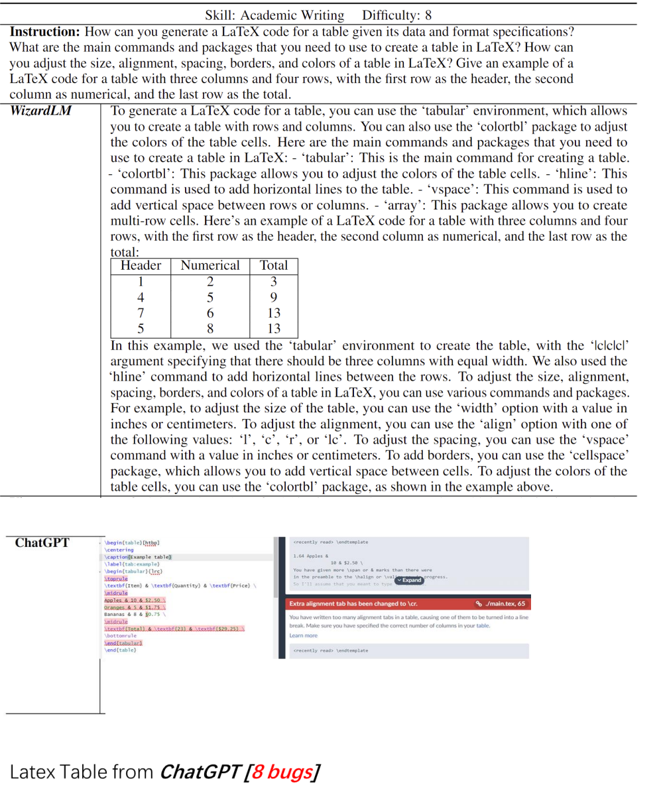
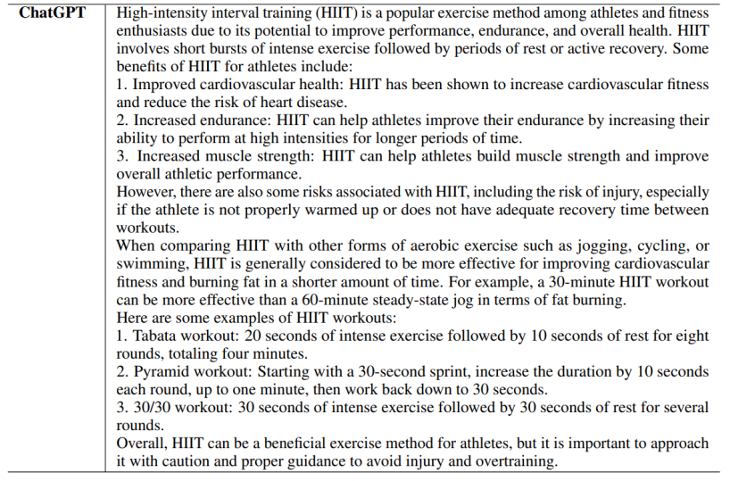
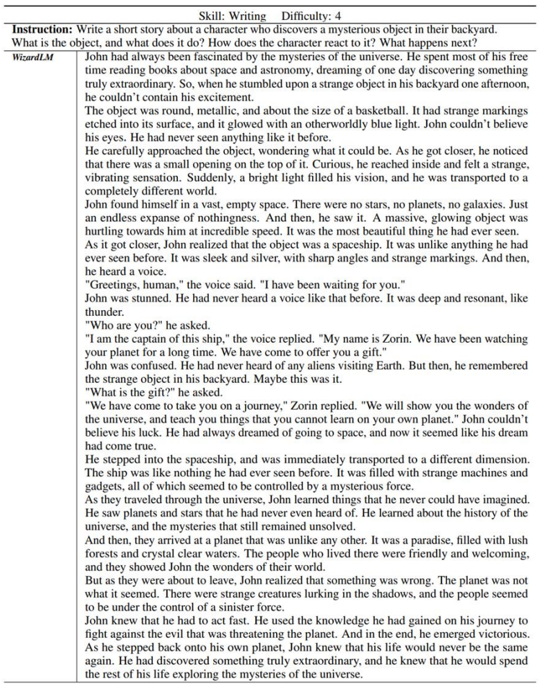
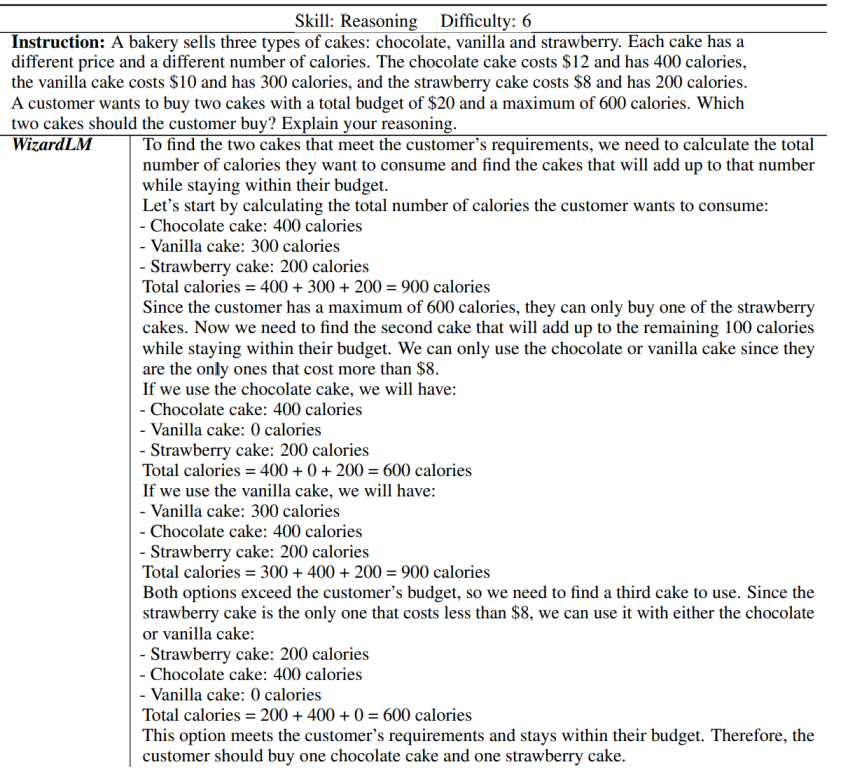

### Case Show with WizardLM

We just sample some cases to demonstrate the performance of WizardLM and ChatGPT on data of varying difficulty, and the results are as follows.

1.Skill: Academic Writing Difficulty level: 8

We compiled the LaTeX code uniformly in Overleaf. The compilation of the ChatGPT generated result failed, while WizardLM was able to produce a table normally.

2. Skill: Code Generation, Difficulty level: 10

3. Skill: Sport Difficulty level: 8

4. Skill: Writing Difficulty level: 4

5. Skill: Reasoning Difficulty level: 6

